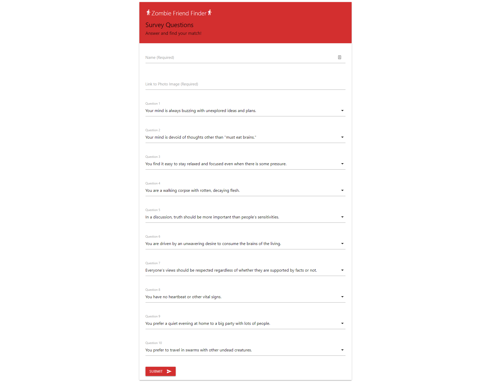
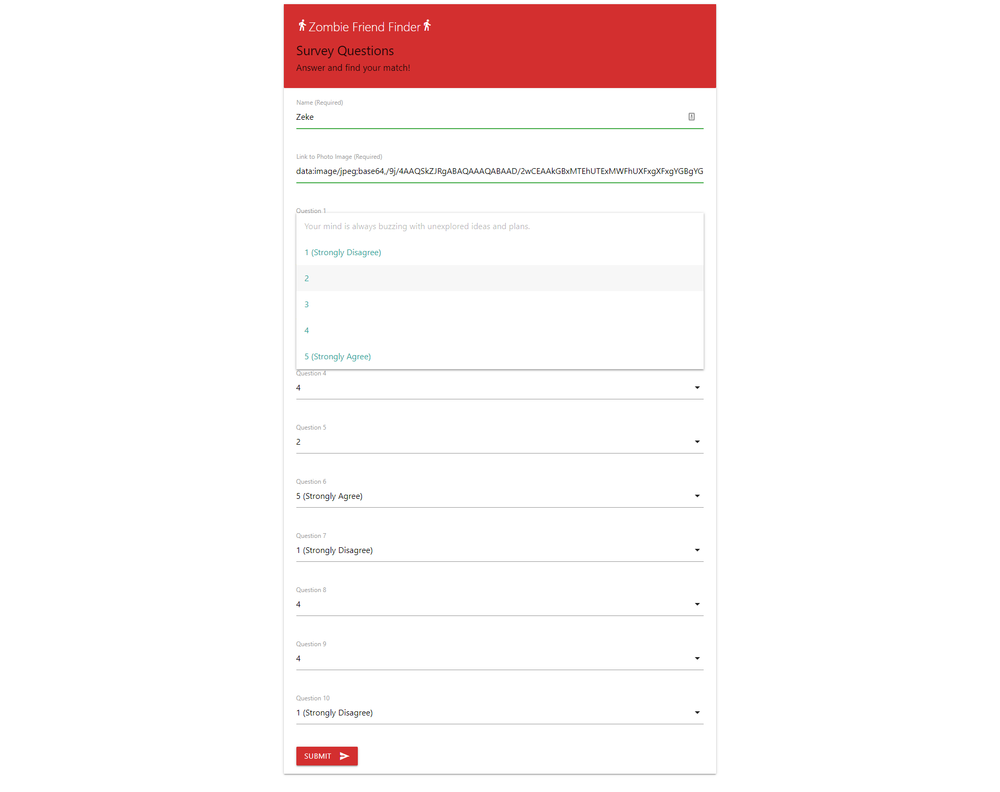
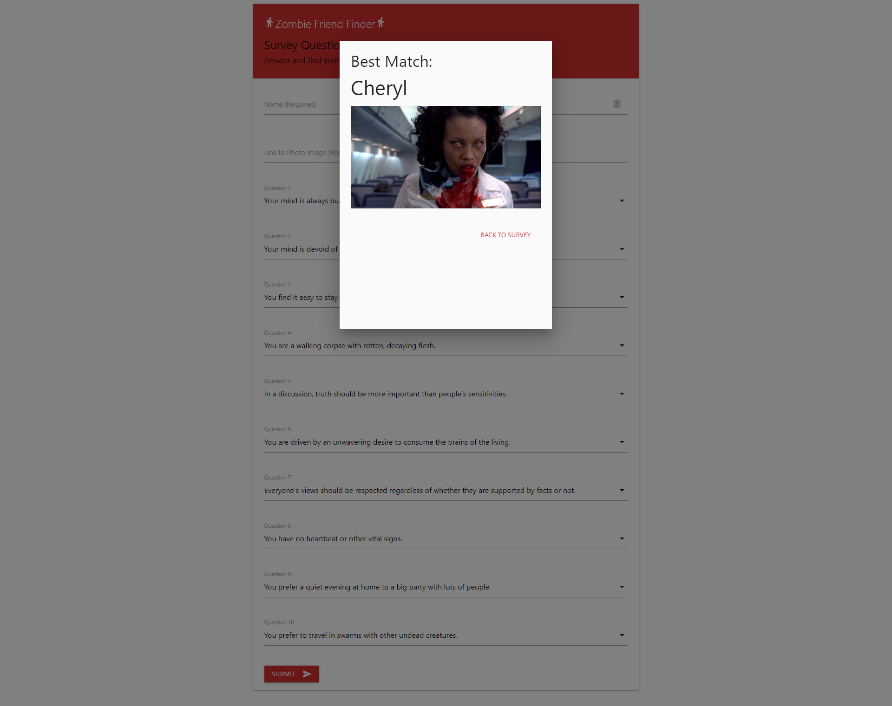

# Zombie Friend Finder
## UNC Coding Bootcamp Node and Express Servers Homework  12-13-2018

This app creates a compatibility-based "FriendFinder" application -- basically a dating app. This full-stack site takes in results from the users' surveys, then compares their answers with those from other users. The app will then display the name and picture of the user with the best overall match. The app includes input validation to prevent the user submitting empty data fields and posting them to the API (../api/friends).

The deployed app can be viewed at: https://zombie-friend-finder.herokuapp.com/

This app uses the following tools:
  * HTML for web page structure
  * Materialize for CSS framework
  * Node.js for Javascript runtime environment
  * Express.js for server setup and routing
  * Javascript for app logic and interactive elements
  * jQuery for additional Javascript functionality and AJAX calls to server
  * Heroku for app deployment and hosting

Installation: requires Express npm package.

### Screenshots

